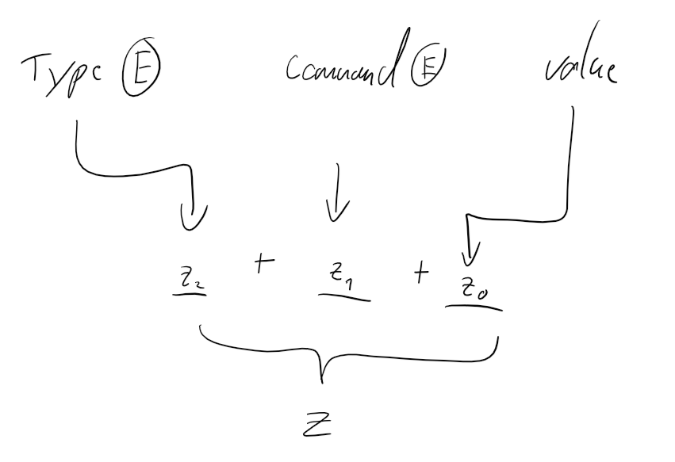
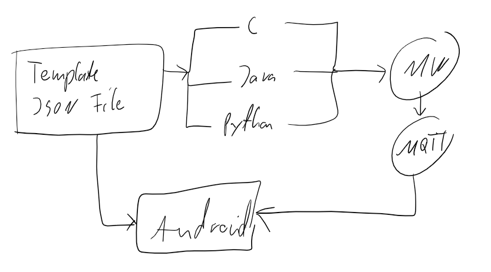

<<<<<<< HEAD
# Technische Fragen

## Standardisierung der Enums für das Binärprotokoll
Überhaupt machen? Wenn ja Ctypes? Wenn ja wie?
Nur gcc kann .so heißt keine cpp header erlaubt in der Kompilierung?
Cpp mit ctypes sonst irgendwie möglich?

Wenn nicht als Rest anfrage möglich. Ansonsten muss man immer die aktuelle Reihenfolge im python und c im enum halten. Sehr fehleranfällig.
=======
# Todos

## Arbeit
### Gliederung ausschreiben
### wichtige Passen schonmal rausschreiben
### verbesserungen an bestehendem Text implementieren

## Binäres Protokoll entwickeln

## C-Library schreiben

## Test mit und ohne QOS2 mit IOT WLAN

## Timeout in Queue

# Aufgekommene Fragen

## JSON unter C?
Protokoll muss einmalig zwischen allen Programmiersprachen standardisiert werden.
Zuerst war die Idee Nachrichten in zwei Systeme aufzuteilen:

1. Binärprotokoll
2. JSON-Basiertes Protokoll

Das Problem ist, dass das Binärprotokoll zwischen Library und Mittelware zum Einsatz kommt.
Dafür sollten pro Typ, Argument und Command ein ENUM zum Einsatz kommen der die Entitäten durchnumeriert.
Die Nummern sollten am Ende entweder als Char oder zusammengesetzt als int übertragen werden.
In der Middleware hätten Sie dann wieder aufgeschlüsselt und in JSON umgewandelt werden müssen.

Die Library soll aber Programmiersprachenunabhänig sein.
Das bedeutet, dass die Enums in jeder Sprache in exakt der gleichen Reihenfolge definiert sein müssen damit es nicht zu fehlern kommt.

Gerade bei Commands kommen jedoch ständig neue hinzu. Diese müssten auf allen anderen Implementierungen auch aktuell gehalten werden.

### Lösung

Die Lösung hierfür ist doch alles per JSON zu machen.
Es wurde sich ursprünglich nur gegen JSON in der Library entschieden, da für C dann extra ein Parser geschrieben werden musste.
JSON ist bei Java und Python nämlich bereits dabei.

Nun soll auf die Lib [cJSON](https://github.com/DaveGamble/cJSON) zurückgegriffen werden.
 Die JSON-Templates sollen dann aus einer Datei ausgelesen werden.
Diese gilt sowohl für die Libraries (C, Python, Java) und Android.

# Abgeleitete Todos

## Big Fuckup Protokoll
- [ ] Protokolle **einzeln** für zwischen den Endgeräten definieren in **einzelnen** Dateien und die dann auch **einzeln** auf die Geräte verteilen.
Warum braucht die lib calls von der middleware aufrufe vom smartphone. bullshit.
- [ ] Nicht auf Anfrage ganze Protokolle rumschicken. get_protocol_request raus. Inhaltlich zu dumm erst anfrage und dann drauf reagieren mit welchen Methoden? Die die er erst kriegt wenn er Sie kriegt. Dann müsste man ja doch wieder statisch definieren. Vorteil von Generalisieung dann? Scheiß drauf. Lieber hardcoded reinschreiben und generalisierung weglassen. Nicht im Detail verlieren.

## ServerIntern
- [x] ZWEI Queues für MQTT work und sensor-request-udp work. Sonst ist:
    1. Der Locking Vorteil für'n Arsch weil nur ein Thread drauf zugreift. Kannste gleich sleepen.
    2. Ganze Schmutz von wegen Queue zubomben gelöst weil egal gibt zwei queues selber schuld wenn lib zu oft fragt.

## Libs
- [x] Impmplementation in Java, C und Python. Python schon halbwegs done. Am Besten zuerst mit der Smartphone-GUI anfangen, dann daraus Calls ableiten.
- [x] EIN Szenario/Aufgabe soll in allen drei Libs funktionieren.

## GUIS
- [ ] GUI schreiben Smartphone
- [ ] GUI schreiben Server 

## Zu klären
- [x] Wie geht Sensorübertragung Sinnvoll? Ganz sicher nicht indem man alles in eine Root-Activity klatscht.
- [ x Wie gehen UDP Bindings in C? Wie drauf reagieren? Warten Auf Return Werte mit Throtteling um überladung zu verhindern?
- [ ] QOS-Level nochmal checken wenn auf 2 mit IOT Wifi besser?

## Arbeit

- [ ] Sensor Hintergrundgeschichte raus braucht kein Mensch
- [ ] Sections tauchen nciht im Inhaltsverzeichnis auf ist das gewollt?
- [ ] Gliederung fertig machen
- Auf Textmasse gehen. Viel schreiben.

### Einleitung
- Deutlich mehr was machen wir kein yadayada
- Wenn Gliederung stimmt, dann auch schonmal gerne vorwärtsverweisen wo was steht. Gibt viel Text

### Aufgabenstellung
- Aufgaben erweitern NACH der Demo
- API immer noch vollständig raus bzw. erst die Anforderungen. API ganz hinten hin.

### Architektur
- Wenn QOS2 nicht funktioniert raus. Scheiß drauf dann ist's halt ein QOS ein Topic fertig. Kann man dann auch überlegen mit mehreren Smarthones.
- Kommandos einmal ganz dumm runterschreiben.
- Sensoren komplett raus oder kurz halten in allgemein und dann citen
- UDP fertig schreiben
- Wie funktioniert die Middleware intern? Und die App? Fehlt komplett!

## Evaluation
- Neues Kapitel in der die Experimente ausprobiert werden. Hier kommen Screenshots und Erklärungen rein.

## Fazit
- Schonmal dran rütteln. Kurze zusammenfassung. Ausblick schonmal. Rest abhängig von der Evalutation
>>>>>>> ddfe0cd7d89bfc19550aa9479e376227f517118a
